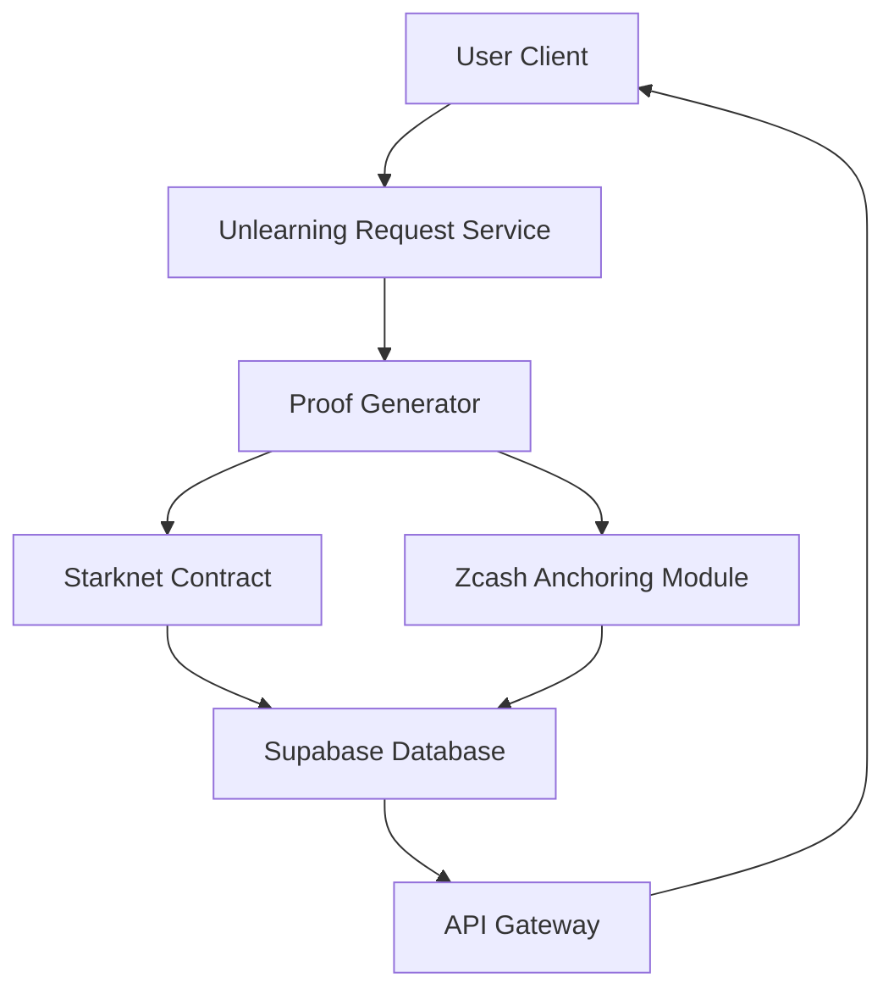

# Forg3t Protocol: Hybrid ZTarknet plus Zcash Unlearning Registry

Forg3t is a revolutionary AI unlearning protocol that combines the power of Starknet's Layer 2 scalability with Zcash's privacy-preserving blockchain technology. This hybrid approach creates an immutable, verifiable, and privacy-respecting registry for AI unlearning proofs.

## 🌟 Project Overview

The Forg3t Protocol addresses the growing need for AI model owners to demonstrably remove specific data from their models while maintaining compliance with privacy regulations like GDPR's Right to be Forgotten. Our innovative solution stores verifiable unlearning proofs on Starknet and anchors hash commitments inside Zcash transactions, creating a tamper-resistant audit trail.

### What is AI Unlearning?

AI unlearning refers to the process of removing the influence of specific data points from trained machine learning models. As AI becomes more pervasive, individuals and organizations increasingly demand the ability to have their data "forgotten" from AI systems, similar to traditional data deletion but technically much more challenging.

### Why It Matters

- **Privacy Compliance**: Meet GDPR, CCPA, and other data protection regulation requirements
- **Trust Building**: Demonstrate commitment to user privacy and data control
- **Risk Mitigation**: Reduce liability from unwanted data retention
- **Ethical AI**: Support responsible AI development practices

### What Forg3t Solves

Traditional AI unlearning approaches lack verifiability and auditability. Forg3t solves this by:
- Creating cryptographically verifiable proofs of unlearning
- Storing proofs immutably on Starknet for public verification
- Anchoring proofs in Zcash transactions for additional tamper resistance
- Providing a transparent yet privacy-preserving audit trail

## 🔧 Main Features

- **Selective Unlearning Registry**: Fine-grained control over what data is unlearned
- **Zcash Transaction Anchoring**: Embedding proof hashes in Zcash memos for L1 anchoring
- **StarkNet Sepolia Smart Contract**: On-chain storage and verification of unlearning proofs
- **Zero-Knowledge Proof Generation**: Privacy-preserving verification of unlearning operations
- **Black Box and White Box Compatibility**: Support for both model-accessible and API-only unlearning
- **Developer Friendly API**: Simple interfaces for integration with existing AI systems
- **Real Working Backend**: Node.js + TypeScript implementation with Supabase integration
- **Modern Frontend**: React-based dashboard for monitoring and managing unlearning requests

## 🏗️ Architecture Overview



### Components

1. **User Client**: Web interface for submitting unlearning requests
2. **Unlearning Request Service**: Processes incoming requests and manages workflow
3. **Proof Generator**: Creates cryptographic proofs of unlearning operations
4. **Starknet Contract**: Stores and verifies unlearning proofs on-chain
5. **Zcash Anchoring Module**: Embeds proof hashes in Zcash transaction memos
6. **Supabase Database**: Stores metadata and request status information
7. **API Gateway**: Provides RESTful interfaces for external integrations

### Data Flow

1. User submits unlearning request through the client interface
2. System generates a cryptographic hash of the unlearning request details
3. Proof generator creates inclusion and deletion proofs for the operation
4. Proof is submitted to the Starknet smart contract for permanent storage
5. A Zcash transaction embeds the proof hash in the memo field for additional anchoring
6. Supabase database stores metadata linking all components together

## 📄 Smart Contract Section

Our Cairo smart contract serves as the primary registry for unlearning proofs on Starknet.

### Key Entry Points

- `push_proof()`: Registers a new unlearning proof on the blockchain
- `get_proof_count()`: Returns the total number of registered proofs
- `verify_proof()`: Validates a proof against stored commitments

### Proof Storage Mechanism

The contract maintains a mapping of job IDs to proof hashes, allowing for efficient verification and retrieval. Each proof hash represents a commitment to the specific unlearning operation performed.

### Extensibility

Developers can extend the contract by:
- Adding new verification methods
- Implementing proof aggregation schemes
- Integrating with other blockchain networks

## 🔐 Zcash Anchoring Section

The Zcash anchoring module provides an additional layer of immutability by embedding proof hashes in Zcash transaction memos.

### Network Usage

The project operates on Zcash testnet for development and can be configured for mainnet deployment.

### Memo Embedding

Proof hashes are encoded and embedded in the memo field of Zcash transactions, creating an auditable trail that leverages Zcash's robust consensus mechanism.

### Auditability Benefits

This dual anchoring approach provides:
- Independent verification through two separate blockchains
- Enhanced tamper resistance through distributed anchoring
- Privacy preservation through Zcash's shielded transactions

## 🛠️ Installation Guide

### Prerequisites

- Node.js (v18 or higher)
- npm or yarn
- Docker (for Zcash regtest environment)
- Starknet account with funded testnet ETH

### Installation Steps

1. **Install Node Dependencies**:
   ```bash
   npm install
   cd backend-service && npm install
   ```

2. **Install Starknet.js**:
   ```bash
   npm install starknet
   ```

3. **Set Up Zcash Docker Regtest Environment**:
   ```bash
   docker-compose up -d
   ```

4. **Configure Supabase**:
   - Create a Supabase project
   - Run the database migration scripts
   - Configure environment variables

## 🌐 Environment Variables

```env
# Starknet Configuration
STARKNET_RPC_URL=https://starknet-sepolia.g.alchemy.com/starknet/version/rpc/v0_10/YOUR_API_KEY
STARKNET_ACCOUNT_ADDRESS=0x...
STARKNET_PRIVATE_KEY=0x...
STARKNET_REGISTRY_CONTRACT_ADDRESS=0x...

# Zcash Configuration
ZCASH_RPC_HOST=localhost
ZCASH_RPC_PORT=18232
ZCASH_RPC_USER=zcashuser
ZCASH_RPC_PASSWORD=zcashpass
ZCASH_SENDER_ADDRESS=utest...

# Supabase Configuration
SUPABASE_URL=https://your-project.supabase.co
SUPABASE_SERVICE_ROLE_KEY=your-service-role-key

# Explorer Configuration
EXPLORER_PORT=3001
```

## ▶️ How To Run Locally

### Backend Service
```bash
cd backend-service
npm run build
npm start
```

### Frontend Application
```bash
npm run dev
```

### Zcash Regtest Node
```bash
docker-compose up -d
```

### Deploying Cairo Contract
```bash
cd cairo-contracts
scarb build
# Use Starknet CLI to deploy
```

## 🎮 Demo Examples

### Submitting an Unlearning Request
```bash
curl -X POST http://localhost:5173/api/unlearning \
  -H "Content-Type: application/json" \
  -d '{
    "modelId": "gpt-4-demo",
    "requestData": "confidential information",
    "reason": "GDPR Article 17 request"
  }'
```

### Checking Proof Count
```bash
curl http://localhost:3001/api/onchain/proof-count
```

## 🏆 Hackathon Pitch Summary

Forg3t represents the world's first verifiable forgetting protocol, combining cutting-edge cryptography with blockchain technology to solve one of AI's most pressing challenges. Our hybrid ZTarknet plus Zcash architecture creates an unprecedented level of trust and accountability in AI unlearning operations.

### Why This Matters

As AI systems become more integrated into our daily lives, the ability to demonstrably remove personal data becomes crucial for maintaining user trust and regulatory compliance. Traditional approaches offer no way to verify that unlearning has actually occurred.

### Unique Architecture

Our dual-blockchain approach leverages Starknet's computational efficiency for proof verification and Zcash's robust consensus for immutable anchoring. This combination provides both performance and security advantages over single-blockchain solutions.

### Powerful Compliance Solution

By creating an auditable, verifiable trail of unlearning operations, Forg3t enables organizations to prove compliance with privacy regulations while preserving the utility of their AI models. This makes it possible to balance innovation with user rights.

## 📄 License

This project is licensed under the MIT License - see the [LICENSE](LICENSE) file for details.

---

🎉 **Ready to revolutionize AI privacy and compliance with Forg3t!** 🎉